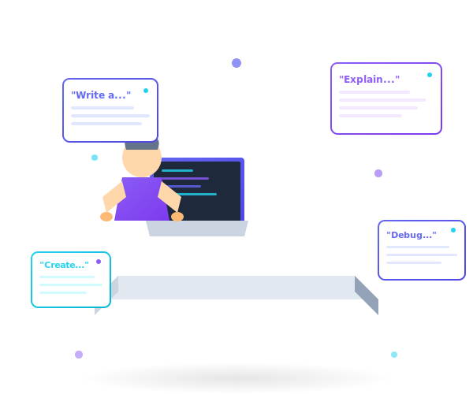

# Prompt Academy - Illustration Gallery

A visual showcase of all illustrations created for the Prompt Academy application.

---

## 🎨 Brand Colors

All illustrations use the official Prompt Academy color palette:

- **Indigo** `#6366F1` - Primary brand color
- **Violet** `#8B5CF6` - Secondary brand color
- **Cyan** `#22D3EE` - Accent color
- Supporting colors for semantic purposes (success, error, etc.)

---

## 🚨 Error Pages

### 404 - Not Found


**Size**: 400x400px | **File**: 6.4KB
**Description**: Lost explorer with map, compass, and confusing signposts
**Features**: Animated question marks, floating elements, confused character
**Usage**: Page not found errors

---

### 500 - Server Error


**Size**: 400x400px | **File**: 7.2KB
**Description**: Robot mechanic fixing broken gears
**Features**: Blinking error lights, rotating gears, animated sparks
**Usage**: Internal server errors, unexpected issues

---

## 📂 Empty States

### Empty Bookmarks


**Size**: 400x350px | **File**: 5.8KB
**Description**: Open book with empty pages and bookmark ribbon
**Features**: Floating stars, gentle animations, plus icons
**Usage**: No saved bookmarks state

---

### Empty Collections


**Size**: 400x350px | **File**: 7.4KB
**Description**: Isometric filing cabinet with empty drawers
**Features**: Floating folders, document icons, sparkles
**Usage**: No collections created state

---

### Empty Search Results


**Size**: 400x350px | **File**: 7.1KB
**Description**: Magnifying glass with no results
**Features**: Fading cards, question marks, animated elements
**Usage**: No search results found

---

### Empty Prompts


**Size**: 400x350px | **File**: 8.0KB
**Description**: Empty text editor with blinking cursor
**Features**: Lightbulb idea indicator, pencil, template cards
**Usage**: No prompts created yet

---

## ✨ Feature Illustrations

### Success / Celebration


**Size**: 400x400px | **File**: 10KB
**Description**: Trophy with graduation cap and confetti
**Features**: Animated confetti (circles, stars, triangles), sparkle bursts
**Usage**: Course completion, achievements, success messages

---

### Learning Path


**Size**: 500x400px | **File**: 11KB
**Description**: Winding road from beginner to expert
**Features**: 4 milestones, person climbing, progress indicator, signposts
**Usage**: Tutorial paths, learning journey visualization

---

## 🔐 Onboarding

### Authentication


**Size**: 400x400px | **File**: 9.7KB
**Description**: Secure login with key, shield, and device
**Features**: Pulsing shield, security particles, welcome badge
**Usage**: Login/signup pages, security features

---

## 🎓 Hero Illustration

### Student Learning


**Size**: 600x500px | **File**: 6.0KB
**Description**: Student at desk with laptop and floating prompt cards
**Features**: Code editor screen, isometric perspective, prompt cards
**Usage**: Homepage hero section

---

## 📊 Statistics

| Category | Count | Total Size |
|----------|-------|------------|
| Error Pages | 2 | 13.6KB |
| Empty States | 4 | 28.3KB |
| Feature Illustrations | 2 | 21KB |
| Onboarding | 1 | 9.7KB |
| Hero | 1 | 6KB |
| **Total** | **10** | **78.6KB** |

---

## 🎯 Design Principles

### Style Characteristics
- **Isometric** perspective for depth
- **Clean and modern** aesthetic
- **Educational** and friendly tone
- **Minimalist** approach
- **Consistent** color usage

### Animation Guidelines
- Subtle floating (2-3s duration)
- Gentle opacity changes (1.5-2s)
- Smooth rotations (6-8s)
- Non-distracting movements
- Respects `prefers-reduced-motion`

### Accessibility
- ✅ WCAG AA color contrast
- ✅ Descriptive alt text
- ✅ Works in light/dark mode
- ✅ Mobile responsive
- ✅ Reduced motion support

---

## 💻 Implementation

### Quick Start
```tsx
// Using Next.js Image (recommended)
import Image from 'next/image'

<Image
  src="/branding/illustrations/errors/404-not-found.svg"
  alt="404 - Page not found"
  width={400}
  height={400}
  className="w-full max-w-md h-auto"
/>
```

### With EmptyState Component
```tsx
import { EmptyState } from '@/components/ui/empty-state'

<EmptyState
  illustrationSrc="/branding/illustrations/empty-states/empty-bookmarks.svg"
  title="No Bookmarks Yet"
  description="Start saving your favorites..."
  size="lg"
  action={{
    label: 'Browse Tutorials',
    onClick: () => {},
  }}
/>
```

### Regular Image Tag
```tsx

```

---

## 📖 Documentation

For detailed documentation, see:
- **Comprehensive Guide**: `/docs/ILLUSTRATIONS.md`
- **Design System**: `/docs/DESIGN_SYSTEM.md`
- **Implementation Summary**: `/ILLUSTRATION_SUMMARY.md`

---

## 🚀 Integration Status

| Illustration | Status | Location |
|--------------|--------|----------|
| 404 Not Found | ✅ Integrated | `/src/app/not-found.tsx` |
| 500 Server Error | ✅ Integrated | `/src/app/error.tsx` |
| Empty Bookmarks | ✅ Integrated | `/src/app/bookmarks/page.tsx` |
| Empty Collections | ✅ Integrated | `/src/app/collections/page.tsx` |
| Empty Search | 🔄 Ready | Awaiting integration |
| Empty Prompts | 🔄 Ready | Awaiting integration |
| Success Celebration | 🔄 Ready | Awaiting integration |
| Learning Path | 🔄 Ready | Awaiting integration |
| Authentication | 🔄 Ready | Awaiting integration |

---

## 🎨 Design Tools

Created using:
- **SVG** format for scalability
- **Inline animations** for performance
- **Optimized gradients** for file size
- **Brand color palette** exclusively

---

## 📝 Notes

- All illustrations are production-ready
- Optimized for performance (< 11KB each)
- Fully responsive and accessible
- Dark mode compatible
- No external dependencies required

---

**Version**: 1.0
**Created**: November 2025
**Maintainer**: Prompt Academy Design Team
